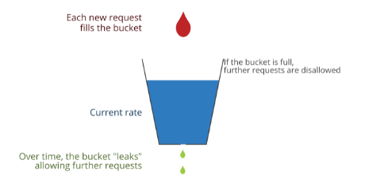

# Rate limiting

Rate limiting is a strategy for limiting network traffic. 
It puts a cap on how often someone can repeat an action within a certain timeframe – for instance, 
trying to log in to an account. Rate limiting can help stop certain kinds of malicious bot activity. 
It can also reduce strain on web servers. 

# What kinds of bot attacks are stopped by rate limiting?
Rate limiting is often employed to stop bad bots from negatively impacting a website or application. 
Bot attacks that rate limiting can help mitigate include:

* Brute force attacks
* DoS and DDoS attacks
* Web scraping

# Algorithms for rate limiting

* Leaky Bucket

Creates a queue (FIFO) with requests, allowing to process them at average rate.
Requests are added to the end of the queue and processed from the beginning of it. 
If the queue is full, new requests will be discarded.

Example:
We have rate limiter with a limit of two requests per minute
`["request_1"]`

We want to process request_2 and add it to the queue
`["request_1", "request_2"]`

If after this we want to add a new request request_3 to the queue, it will be discarded

Pros:
- easy to implement
- memory efficient

Cons:
- no guarantee that the request will be processed in certain amount of time
- old requests can fill the queue and recent requests will not be able to be processed

# Task

Implement the leaky bucket algorithm with known capacity  of the bucket - rate_limit - total
number of requests that can land in a bucket. 

The bucket is leaking with constant rate (consumption rate).

Whenever a new request gets in, the algorithm performs the following actions:

Test if adding the request's cost to the bucket would exceed its capacity; in that case, return False
Otherwise, add the request's cost to the bucket, and return True

# Solution 
The one trying to send a request must add a token to the bucket first (like paying a tax) meanwhile a token is taken out of the bucket at a constant rate.
In this case, when a bucket is full a request needs to wait until a new token can be added, and when the bucket is empty no tokens are taken out.
We need a queue to hold the total amount of tokens for requests allowed at any given time.
The max number of tokens is the rate limit.
If we want to create a request we first try to add a token to the queue.
If the queue is full we block the request until we have a free slot in the queue.
while adding tokens, we need a task that consumes tokens and free slots from the queue at a constant rate which will make sure we never exceed the rate allowed.

